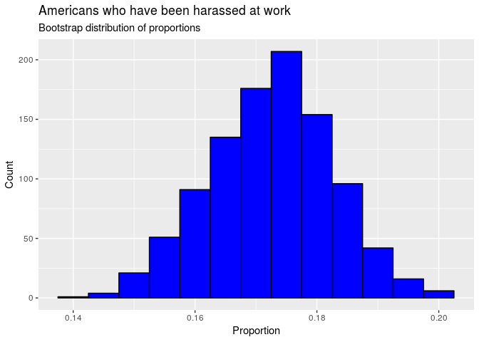
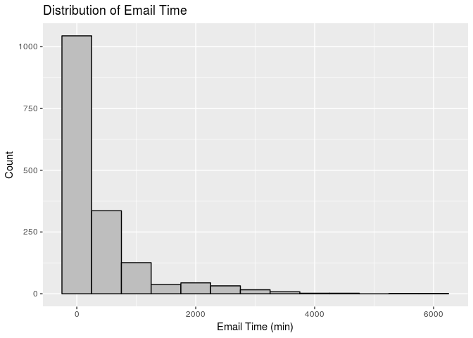
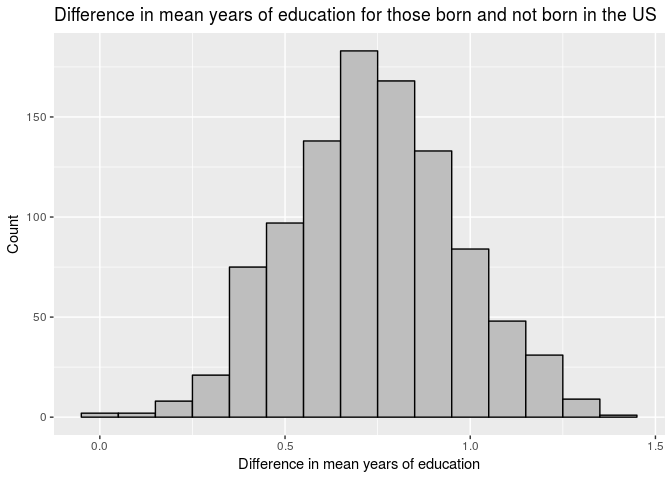

HW 09 - Bootstrapping the GSS
================
Team yiit
2018-11-03

### Load packages

``` r
library(infer)
library(tidyverse)
library(readr)
```

### Load data

``` r
gss2016 <- read_csv("gss2016.csv", guess_max = )
```

### Set seed

``` r
set.seed(12354)
```

### Exercise 1

``` r
gss2016 %>%
  count(harass5)
```

    ## # A tibble: 6 x 2
    ##   harass5                                                     n
    ##   <chr>                                                   <int>
    ## 1 Does not apply (i do not have a job/superior/co-worker)    96
    ## 2 Don't know                                                  1
    ## 3 No                                                       1136
    ## 4 No answer                                                   7
    ## 5 Not applicable                                           1390
    ## 6 Yes                                                       237

The possible responses to this question are Does not apply (i do not
have a job/superior/co-worker), Don’t know, No, No answer, Not
applicable, and Yes. The number of people who said each response is 96,
1, 1136, 7, 1390, and 237 respectively.

### Exercise 2

``` r
harassed <- gss2016 %>%
  filter(harass5 == "Yes" | harass5 == "No")
```

### Exercise 3

``` r
harassed %>%
  group_by(harass5) %>%
  summarise(n = n()) %>%
  mutate(prop = scales::percent(n / sum(n)))
```

    ## # A tibble: 2 x 3
    ##   harass5     n prop 
    ##   <chr>   <int> <chr>
    ## 1 No       1136 82.7%
    ## 2 Yes       237 17.3%

82.7% of respondents for whom this question is applicable to have been
harassed by their superiors or co-workers at their job.

### Exercise 4

``` r
harass_bs <- 
  harassed %>%
    specify(response = harass5, success = "Yes") %>% 
    generate(reps = 1000, type = "bootstrap") %>% 
    calculate(stat = "prop")

harass_bs
```

    ## # A tibble: 1,000 x 2
    ##    replicate  stat
    ##        <int> <dbl>
    ##  1         1 0.170
    ##  2         2 0.173
    ##  3         3 0.172
    ##  4         4 0.169
    ##  5         5 0.168
    ##  6         6 0.181
    ##  7         7 0.165
    ##  8         8 0.151
    ##  9         9 0.149
    ## 10        10 0.184
    ## # ... with 990 more rows

``` r
ggplot(data = harass_bs, 
       mapping = aes(x = stat)) +
  geom_histogram(binwidth = 0.005, 
                 fill = "Grey", 
                 color = "Black") +
  labs(title = "Americans who have been harassed at work",
       subtitle = "Bootstrap distribution of proportions",
       x = "Proportion",
       y = "Count")
```

<!-- -->

### Exercise 5

``` r
harass_bs %>%
  summarise(
    lower = quantile(stat, 0.025),
    upper = quantile(stat, 0.975),
    )
```

    ## # A tibble: 1 x 2
    ##   lower upper
    ##   <dbl> <dbl>
    ## 1 0.152 0.192

The 95% bootstrap confidence interval based on the distribution we
constructed above is 0.152 to 0.192.

### Exercise 6

We are 95% confident that the median percentage of those who have been
harassed by their superiors or co-workers at their job is between 15.2%
and 19.2%.

### Exercise 7

To be 95% confident means that that there is a 95% chance that the
confidence interval determined contains the true value of the proportion
of Americans who are harassed at work. We can say with 95% confidence,
or certainty, that the true percentage of Americans who are harassed at
work lies within our confidence interval.

### Exercise 8

90% confidence interval: (0.157, 0.189)

99% confidence interval: (0.147, 0.196)

If the confidence that our interval contains the true proportion of
Americans who are harassed at work increases, then the interval must
become wider, and vice versa. This is because as the interval widens to
cover more potential proportion values, there is a greater probability
(or confidence) that it contains the true proportion.

### Exercise 9

``` r
gss2016 <- gss2016 %>%
  mutate(email = 60*as.numeric(emailhr) + as.numeric(emailmin)) 
```

    ## Warning in evalq(60 * as.numeric(emailhr) + as.numeric(emailmin),
    ## <environment>): NAs introduced by coercion
    
    ## Warning in evalq(60 * as.numeric(emailhr) + as.numeric(emailmin),
    ## <environment>): NAs introduced by coercion

### Exercise 10

``` r
non_NA_email <- gss2016 %>%
  select(email) %>%
  filter(is.na(email) == FALSE)
```

### Exercise 11

``` r
ggplot(data = non_NA_email, 
       mapping = aes(x = email)) +
  geom_histogram(binwidth = 500, 
                 fill = "Grey", 
                 color = "Black") +
  labs(title = "Distribution of Email Time",
       x = "Email Time (min)",
       y = "Count")
```

<!-- -->

``` r
non_NA_email %>%
  summarise(med = median(email), 
            mean = mean(email))
```

    ## # A tibble: 1 x 2
    ##     med  mean
    ##   <dbl> <dbl>
    ## 1   120  417.

The media is a preferrable measure of the amount of time Americans spend
using email, because the distribution of time spent on email is right
skewed, and the median statistic is able to be insensitive to skew
whereas mean is not.

### Exercise 12

Bootstrapping is used to estimate a statistic that describes the amount
of time that all Americans spend using email weekly. It does this by
creating a bootstrap distribution of medians using several samples from
the email data, and then creating a confidence interval that estimates
the true population median to a given degree of certainty/confidence.

### Exercise 13

``` r
email_bs <- non_NA_email %>%
  specify(response = email) %>% 
  generate(reps = 1000, 
           type = "bootstrap") %>% 
  calculate(stat = "median")

email_bs
```

    ## # A tibble: 1,000 x 2
    ##    replicate  stat
    ##        <int> <dbl>
    ##  1         1   120
    ##  2         2   120
    ##  3         3   120
    ##  4         4   120
    ##  5         5   120
    ##  6         6   120
    ##  7         7   120
    ##  8         8   120
    ##  9         9   120
    ## 10        10   120
    ## # ... with 990 more rows

``` r
email_bs %>%
summarize(lower = format(round(quantile(stat, 0.05), 4), nsmall = 4),
upper = format(round(quantile(stat, 0.95), 4), nsmall = 4))
```

    ## # A tibble: 1 x 2
    ##   lower    upper   
    ##   <chr>    <chr>   
    ## 1 120.0000 120.0000

The 90% confidence interval is (120, 120). This means that we can say
with 90% confidence that the median time that American workers spend
using email is 2 hours per week. The calculated confidence interval has
the same upper and lower bounds most likely because 120 was a modal
value in the original data, meaning that many individuals spent 2 hours
per week, such that a confidence interval with 90% confidence would
suggest that Americans spend 2 hours per week on
    email.

### Exercise 14

``` r
gss2016 <- mutate(gss2016, educ = as.integer(gss2016$educ))
```

    ## Warning in evalq(as.integer(gss2016$educ), <environment>): NAs introduced
    ## by coercion

``` r
gss_noNA <- gss2016 %>%
  select(educ, born) %>%
  filter(born != "No answer") %>%
  filter(is.na(educ) == "FALSE")


boot_meandiff <- gss_noNA %>%
  specify(response = educ, explanatory = born) %>%
  generate(reps = 1000, type = "bootstrap") %>%
  calculate(stat = "diff in means", order = c(born = "Yes", born = "No"))

ggplot(data = boot_meandiff, 
       mapping = aes(x = stat)) +
  geom_histogram(binwidth = 0.1, 
                 fill = "Grey", 
                 color = "Black") +
  labs(title = "Difference in mean years of education for those born and not born in the US",
       x = "Difference in mean years of education",
       y = "Count")
```

<!-- -->

``` r
boot_meandiff %>%
  summarise(quantile(stat, 0.005), 
            quantile(stat, 0.995))
```

    ## # A tibble: 1 x 2
    ##   `quantile(stat, 0.005)` `quantile(stat, 0.995)`
    ##                     <dbl>                   <dbl>
    ## 1                   0.166                    1.26

We can say with 99% confidence, or certainty, that the difference in
mean years of education for those born and not born in the US lies
between 0.166 and 1.26.

### Exercise 15

``` r
gss2016 <- gss2016 %>%
  select(advfront, polviews) %>%
  filter(advfront != "Dont know" & advfront != "No answer" & advfront != "Not applicable") %>%
  filter(polviews != "Don't know" & polviews != "No answer")

  
simple_politics <- mutate(gss2016, advfront = case_when(
  str_detect(advfront, "agree")           ~"Yes", 
  TRUE                                    ~"No"
))
```

### Exercise 16

### Exercise 17

### Exercise 18

### Exercise 19
