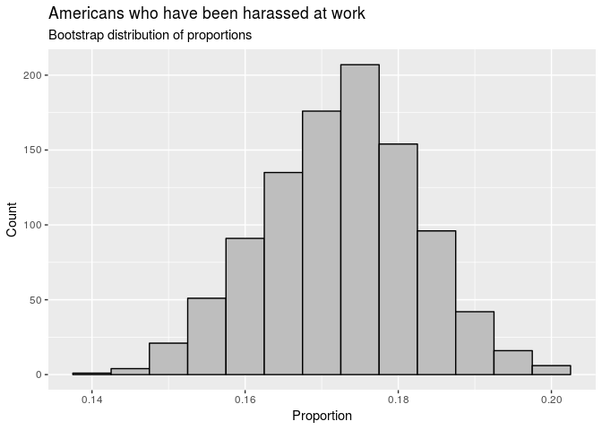

HW 09 - Bootstrapping the GSS
================
Team yiit
2018-11-03

### Load packages

``` r
library(infer)
library(tidyverse)
```

### Load data

``` r
gss2016 <- read_csv("gss2016.csv")
```

### Set seed

``` r
set.seed(12354)
```

### Exercise 1

``` r
gss2016 %>%
  count(harass5)
```

    ## # A tibble: 6 x 2
    ##   harass5                                                     n
    ##   <chr>                                                   <int>
    ## 1 Does not apply (i do not have a job/superior/co-worker)    96
    ## 2 Don't know                                                  1
    ## 3 No                                                       1136
    ## 4 No answer                                                   7
    ## 5 Not applicable                                           1390
    ## 6 Yes                                                       237

The possible responses to this question are Does not apply (i do not
have a job/superior/co-worker), Don’t know, No, No answer, Not
applicable, and Yes. The number of people who said each response is 96,
1, 1136, 7, 1390, and 237 respectively.

### Exercise 2

``` r
harassed <- gss2016 %>%
  filter(harass5 == "Yes" | harass5 == "No")
```

### Exercise 3

``` r
harassed %>%
  group_by(harass5) %>%
  summarise(n = n()) %>%
  mutate(prop = scales::percent(n / sum(n)))
```

    ## # A tibble: 2 x 3
    ##   harass5     n prop 
    ##   <chr>   <int> <chr>
    ## 1 No       1136 82.7%
    ## 2 Yes       237 17.3%

82.7% of respondents for whom this question is applicable to have been
harassed by their superiors or co-workers at their job.

### Exercise 4

``` r
harass_bs <- 
  harassed %>%
    specify(response = harass5, success = "Yes") %>% 
    generate(reps = 1000, type = "bootstrap") %>% 
    calculate(stat = "prop")

harass_bs
```

    ## # A tibble: 1,000 x 2
    ##    replicate  stat
    ##        <int> <dbl>
    ##  1         1 0.170
    ##  2         2 0.173
    ##  3         3 0.172
    ##  4         4 0.169
    ##  5         5 0.168
    ##  6         6 0.181
    ##  7         7 0.165
    ##  8         8 0.151
    ##  9         9 0.149
    ## 10        10 0.184
    ## # ... with 990 more rows

``` r
ggplot(data = harass_bs, 
       mapping = aes(x = stat)) +
  geom_histogram(binwidth = 0.005, 
                 fill = "Blue", 
                 color = "Black") +
  labs(title = "Americans who have been harassed at work",
       subtitle = "Bootstrap distribution of proportions",
       x = "Proportion",
       y = "Count")
```

<!-- -->

### Exercise 5

``` r
harass_bs %>%
  summarise(
    lower = quantile(stat, 0.025),
    upper = quantile(stat, 0.975),
    )
```

    ## # A tibble: 1 x 2
    ##   lower upper
    ##   <dbl> <dbl>
    ## 1 0.152 0.192

The 95% bootstrap confidence interval based on the distribution we
constructed above is 0.152 to 0.192.

### Exercise 6

We are 95% confident that the median percentage of those who have been
harassed by their superiors or co-workers at their job is between 15.2%
and 19.2%.

### Exercise 7

### Exercise 8

### Exercise 9

### Exercise 10

### Exercise 11

### Exercise 12

### Exercise 13

### Exercise 14

### Exercise 15

### Exercise 16

### Exercise 17

### Exercise 18

### Exercise 19
